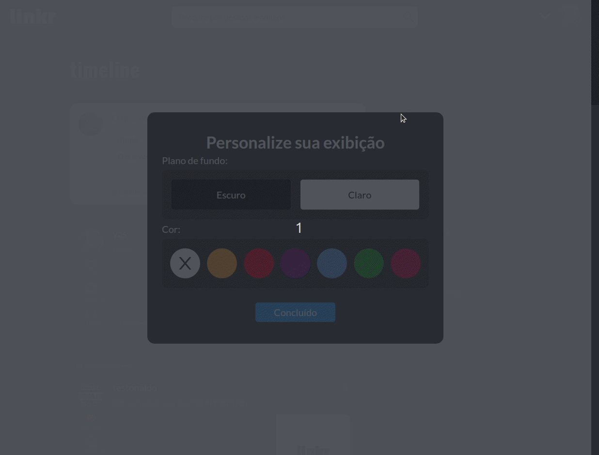

# Linkr

This is a social media created to make it easier to share interesting links, sites and videos found all over the internet. Come take a look!

To achieve this goal, it was developed as a single page application using [ReactJS](https://github.com/facebook/create-react-app).

This is a fork of this [project](https://github.com/Nello-Moreira/Projeto11_Linkr) I developed in collaboration with [Gabriel](https://github.com/Nello-Moreira) and [Gian](https://github.com/giancarvalho). We made it to "[bootcamp de desenvolvimento web full stack - Responde aí/Driven](https://driven.com.br/)" (full-stack web development) and now I'm working on developing new features to practice my skills with React.

# Technologies

-   HTML
-   CSS
-   JavaScript || ReactJS || Axios

# See the result here

[Versel Deployment](https://linkr-ecru.vercel.app/)
